# 🤖 TITAN AI Voice Assistant — Developer Roadmap

> **Step-by-Step Guide: Setup, Run, & Extend Your Jarvis**

| Metric | Value |
|---|---|
| **Core Modules** | 20+ |
| **AI Engines** | 3 (Gemini, Speech Recognition, pyttsx3 TTS) |
| **Dev Phases** | 5 |
| **Backend Framework** | FastAPI |
| **Target Platform** | Windows (primary), Mac/Linux (partial) |

---

## Table of Contents

1. [Project Overview & Module Architecture](#1-project-overview--module-architecture)
2. [Phase 1: Environment Setup](#2-phase-1-environment-setup)
3. [Phase 2: Core Modules Deep Dive](#3-phase-2-core-modules-deep-dive)
4. [Phase 3: API Keys & Configuration](#4-phase-3-api-keys--configuration)
5. [Phase 4: Running the Project](#5-phase-4-running-the-project)
6. [Phase 5: Features & Future Roadmap](#6-phase-5-features--future-roadmap)
7. [Architecture & Flow Distribution](#7-architecture--flow-distribution)
8. [Quick Command Reference](#8-quick-command-reference)
9. [Troubleshooting & FAQs](#9-troubleshooting--faqs)

---

## 1. Project Overview & Module Architecture

### Kya hai yeh project? (What is this project?)

TITAN ek **Python-based AI Voice Assistant** hai — bilkul Iron Man ke Jarvis ki tarah. Yeh aapke computer ko **voice ya text commands** se control karta hai. Iske andar **FastAPI backend server** hai jo ek bridge ka kaam karta hai frontend aur core modules ke beech.

### Core Files & Modules Architecture

```
TITAN/
├── backend/
│   ├── core/
│   │   ├── Wake_Word_detection.py    # Entry Point — Mic listener
│   │   ├── jarvis_controller.py      # Brain — Command router
│   │   ├── bridge_server.py          # FastAPI REST API server
│   │   ├── app_launcher.py           # App & search launcher
│   │   ├── system_controller.py      # Volume, brightness, lock
│   │   ├── window_manager.py         # Window minimize/maximize/close
│   │   ├── keyboard_controller.py    # Keyboard input automation
│   │   ├── camera_vision.py          # Webcam + Gemini AI vision
│   │   ├── medical.py                # Health advisor (Hindi/English)
│   │   ├── jarvis_email.py           # Gmail email sender
│   │   ├── gnews.py                  # GNews API news fetcher
│   │   ├── mobile_controller.py      # Mobile app control via webhook
│   │   ├── custom_wake_word.py       # 🆕 Custom wake word engine
│   │   ├── spotify_controller.py     # 🆕 Spotify voice control
│   │   ├── file_manager.py           # 🆕 File/folder operations
│   │   ├── calendar_manager.py       # 🆕 Google Calendar integration
│   │   ├── screen_reader.py          # 🆕 Screen capture + AI analysis
│   │   ├── hindi_voice.py            # 🆕 Hindi/Hinglish voice support
│   │   ├── local_llm.py              # 🆕 Ollama offline AI
│   │   └── plugin_manager.py         # 🆕 Dynamic plugin system
│   ├── plugins/                       # 🆕 Custom plugin modules
│   │   ├── base_plugin.py            # Abstract plugin base class
│   │   ├── weather_plugin/           # Example plugin
│   │   └── calculator_plugin/        # Example plugin
│   ├── .env                          # API keys & secrets (NEVER commit)
│   ├── credentials.json              # 🆕 Google OAuth (NEVER commit)
│   ├── requirements.txt              # Python dependencies
│   └── venv/                         # Virtual environment
└── frontend/                         # 🆕 React/Vite dashboard UI
    ├── src/
    ├── package.json
    └── vite.config.js
```

### Module Layer Map

| Layer | File | Kya Karta Hai (Function) |
|---|---|---|
| 🎤 **Entry** | `Wake_Word_detection.py` | Mic se "Jarvis" sun-ta hai, activate hota hai |
| 🧠 **Brain** | `jarvis_controller.py` | Command parse karta hai, sahi module call karta hai |
| 🌐 **Server** | `bridge_server.py` | FastAPI REST API — `localhost:8000` |
| 📱 **Apps** | `app_launcher.py` | Apps kholta hai, YouTube/Google search |
| ⚙️ **System** | `system_controller.py` | Volume, brightness, lock screen |
| 🪟 **Windows** | `window_manager.py` | Windows minimize/maximize/close |
| ⌨️ **Keyboard** | `keyboard_controller.py` | Text type karna, keys press karna |
| 👁️ **AI Vision** | `camera_vision.py` | Webcam + Gemini AI se image analyze |
| 🏥 **Medical** | `medical.py` | Hindi/English mein health advice |
| 📧 **Email** | `jarvis_email.py` | Gmail se email bhejna |
| 📰 **News** | `gnews.py` | GNews API se latest news |
| 📲 **Mobile** | `mobile_controller.py` | Webhook se mobile apps control |
| 🖥️ **Dashboard** | `frontend/` | 🆕 React UI dashboard with real-time status |
| 🎙️ **Wake Word** | `custom_wake_word.py` | 🆕 Custom wake word (Porcupine/OpenWakeWord) |
| 🎵 **Spotify** | `spotify_controller.py` | 🆕 Voice-controlled music playback |
| 📁 **Files** | `file_manager.py` | 🆕 File/folder create, move, delete, search |
| 📅 **Calendar** | `calendar_manager.py` | 🆕 Google Calendar events & reminders |
| 🖥️ **Screen** | `screen_reader.py` | 🆕 Screen capture + AI/OCR analysis |
| 🗣️ **Hindi** | `hindi_voice.py` | 🆕 Full Hindi/Hinglish voice support |
| 🧠 **Local AI** | `local_llm.py` | 🆕 Ollama offline AI (Llama/Mistral) |
| 🔌 **Plugins** | `plugin_manager.py` | 🆕 Dynamic plugin loading & hot-reload |

---

## 2. Phase 1: Environment Setup

> [!IMPORTANT]
> Project chalane se pehle yeh **saare steps** complete karo. Ek bhi skip kiya toh errors aayenge.

### Step 1: Python Install Karo

- **Python 3.10+** chahiye (Python **3.11 recommended**)
- [python.org](https://python.org) se download karo
- ⚠️ **"Add to PATH" checkbox zaroor tick karo** — nahi kiya toh `python` command nahi chalegi

**Verify installation:**
```powershell
python --version
# Expected: Python 3.11.x
pip --version
# Expected: pip 23.x+
```

### Step 2: Project Extract Karo

1. ZIP file ko kisi **clean folder** mein extract karo
2. Example path: `C:/Projects/TITAN/`
3. VS Code mein folder open karo:

```powershell
cd C:/Projects/TITAN/backend
code .
```

### Step 3: Virtual Environment Banao

> [!TIP]
> Ek alag `venv` banao taaki system Python clean rahega. Har baar project chalane se pehle isko **activate** karo.

```powershell
# Create virtual environment
python -m venv venv

# Activate (Windows)
venv\Scripts\activate

# Activate (Mac/Linux)
# source venv/bin/activate
```

✅ Activate hone ke baad terminal mein `(venv)` prefix dikhega:
```
(venv) C:\Projects\TITAN\backend>
```

### Step 4: Dependencies Install Karo

> [!NOTE]
> Internet connection zaroori hai pehli baar install karte waqt.

```bash
pip install fastapi uvicorn pydantic speechrecognition
pip install pyttsx3 pyautogui opencv-python python-dotenv
pip install google-generativeai requests pywin32 keyboard
pip install mouse psutil pillow
```

**Or create a `requirements.txt`:**
```txt
fastapi>=0.104.0
uvicorn>=0.24.0
pydantic>=2.5.0
speechrecognition>=3.10.0
pyttsx3>=2.90
pyautogui>=0.9.54
opencv-python>=4.8.0
python-dotenv>=1.0.0
google-generativeai>=0.3.0
requests>=2.31.0
pywin32>=306
keyboard>=0.13.5
mouse>=0.7.1
psutil>=5.9.0
pillow>=10.0.0
```

```bash
pip install -r requirements.txt
```

---

## 3. Phase 2: Core Modules Deep Dive

### 🎤 `Wake_Word_detection.py` — Entry Point

**Purpose:** Microphone continuously sun-ta rehta hai. "Jarvis" detect hone par system activate hota hai.

**Key Technologies:**
- `SpeechRecognition` — Google Speech API for voice-to-text
- `pyttsx3` — Offline text-to-speech engine

**Flow:**
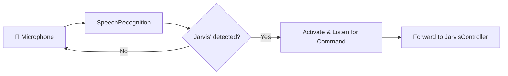

**Implementation Checklist:**
- [ ] Initialize microphone with ambient noise adjustment
- [ ] Continuous listening loop with error handling
- [ ] Wake word detection ("Jarvis" keyword match)
- [ ] Command capture after activation
- [ ] Forward parsed command to `jarvis_controller.py`
- [ ] Audio feedback via `pyttsx3` (e.g., "Yes sir?")

---

### 🌐 `bridge_server.py` — API Server

**Purpose:** FastAPI se REST endpoints banata hai jo frontend/external tools se communicate karte hain.

**Base URL:** `http://localhost:8000`

**API Endpoints:**

| Method | Endpoint | Description |
|---|---|---|
| `POST` | `/command` | General voice/text command execute karo |
| `POST` | `/launch` | App launch karo by name |
| `POST` | `/keyboard` | Keyboard action perform karo |
| `POST` | `/window` | Window management (min/max/close) |
| `GET` | `/docs` | Swagger UI (auto-generated) |
| `GET` | `/health` | Server health check |

**Implementation Checklist:**
- [ ] FastAPI app initialization with CORS middleware
- [ ] Define Pydantic request/response models
- [ ] Implement all POST endpoints
- [ ] Add error handling & logging
- [ ] Health check endpoint
- [ ] Auto-generated Swagger docs at `/docs`

---

### 🧠 `jarvis_controller.py` — The Brain

**Purpose:** Sab commands yahan process hoti hain. Command text parse karta hai aur correct module ko call karta hai.

**Command Routing Logic:**

| Command Pattern | Action | Target Module |
|---|---|---|
| `play X` | YouTube par video chalao | `app_launcher.py` |
| `search X` / `google X` | Google search karo | `app_launcher.py` |
| `type X` | Text type karo | `keyboard_controller.py` |
| `press X` | Key press karo | `keyboard_controller.py` |
| `volume up/down` | Volume control | `system_controller.py` |
| `lock screen` | Screen lock karo | `system_controller.py` |
| `minimize/maximize/close X` | Window control | `window_manager.py` |
| `open X` / `launch X` | App open karo | `app_launcher.py` |
| `take photo` / `what do you see` | Camera + AI vision | `camera_vision.py` |
| `health / medical` | Health advice | `medical.py` |
| `send email` | Email bhejna | `jarvis_email.py` |
| `news` / `headlines` | Latest news | `gnews.py` |
| `send msg to X saying Y` | WhatsApp message | `mobile_controller.py` |

**Implementation Checklist:**
- [ ] Command parser with keyword matching
- [ ] Route commands to appropriate modules
- [ ] Command history storage (in-memory list or SQLite)
- [ ] Fallback handler for unknown commands
- [ ] Response formatting for TTS output
- [ ] Error handling with user-friendly messages

---

### 👁️ `camera_vision.py` — AI Vision

**Purpose:** Webcam (OpenCV) se snapshot leta hai aur Google Gemini API ko bhej kar detailed description nikalta hai.

> [!IMPORTANT]
> `GEMINI_API_KEY` zaroori hai. Bina key ke yeh module kaam nahi karega.

**Flow:**
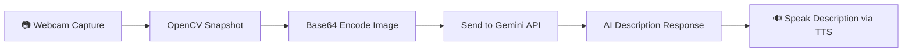

**Implementation Checklist:**
- [ ] OpenCV webcam initialization & frame capture
- [ ] Image encoding (Base64 for API)
- [ ] Gemini `generateContent` with image + prompt
- [ ] Parse AI response and format for speech
- [ ] Error handling (camera not found, API failure)
- [ ] Cleanup: release camera after capture

---

### 🏥 `medical.py` — Medical AI Assistant

**Purpose:** Hindi/English health advisor. Symptoms ke basis par general advice deta hai.

**Supported Hindi Keywords:**

| Hindi Keyword | English Equivalent |
|---|---|
| `bukhar` | Fever |
| `sir dard` | Headache |
| `pet dard` | Stomach ache |
| `khansi` | Cough |
| `thakan` | Fatigue |

**Implementation Checklist:**
- [ ] Symptom keyword matching (Hindi + English)
- [ ] General health advice responses
- [ ] ⚠️ **Disclaimer**: "Prescription nahi deta, doctor refer karta hai"
- [ ] Gemini AI integration for detailed health info
- [ ] Response in user's preferred language

---

### 📧 `jarvis_email.py` — Email Module

**Implementation Checklist:**
- [ ] SMTP connection to Gmail (`smtp.gmail.com:587`)
- [ ] Authentication with App Password (NOT regular password)
- [ ] Compose email from voice command parsing
- [ ] Send email with confirmation feedback
- [ ] Error handling for auth failures

---

### 📰 `gnews.py` — News Fetcher

**Implementation Checklist:**
- [ ] GNews API integration with API key
- [ ] Fetch top headlines (configurable count)
- [ ] Category filtering (tech, sports, business, etc.)
- [ ] Format headlines for TTS reading
- [ ] Error handling for API rate limits

---

### 📱 `mobile_controller.py` — Mobile Control

**Implementation Checklist:**
- [ ] Webhook endpoint for mobile app triggers
- [ ] WhatsApp message sending capability
- [ ] Mobile notification relay
- [ ] Connection status monitoring

---

## 4. Phase 3: API Keys & Configuration

> [!CAUTION]
> **Real API keys kabhi GitHub par push mat karo!** `.gitignore` mein `.env` add karo.

### Required API Keys

| Variable | Service | Kahan Se Milegi | Status |
|---|---|---|---|
| `GEMINI_API_KEY` | Google Gemini AI | [aistudio.google.com](https://aistudio.google.com) | 🔴 **Required** |
| `GNEWS_API_KEY` | GNews API | [gnews.io/register](https://gnews.io/register) | 🔴 **Required** |
| `EMAIL_ADDRESS` | Gmail Account | Apna Gmail address | 🔴 **Required** |
| `EMAIL_PASSWORD` | Gmail App Password | Google Account → App Passwords | 🔴 **Required** |
| `ADMIN_EMAIL` | Admin Notifications | Koi bhi email | 🟡 Optional |

### `.env` File Template

```env
# === TITAN AI Configuration ===

# Google Gemini AI (Vision + Medical + General AI)
GEMINI_API_KEY=your_gemini_api_key_here

# GNews API (News headlines)
GNEWS_API_KEY=your_gnews_api_key_here

# Gmail Configuration (Email module)
EMAIL_ADDRESS=your_email@gmail.com
EMAIL_PASSWORD=your_16_char_app_password

# Admin (Optional)
ADMIN_EMAIL=admin@example.com
```

### `.gitignore` Entry

```gitignore
# Secrets
.env
*.env

# Virtual environment
venv/
__pycache__/
```

### 📋 Gmail App Password Kaise Banayein

> [!WARNING]
> Normal Gmail password se email **nahi jayega**. Aapko **App Password** generate karna padega.

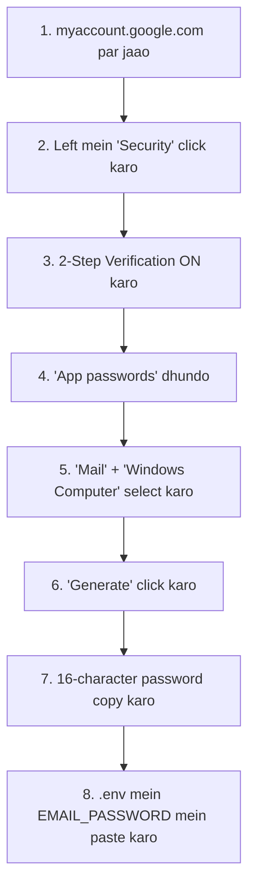

> [!IMPORTANT]
> Pehle **2-Step Verification (2FA) ON** karo — yeh zaroori hai. Tabhi App Password option dikhega.

---

## 5. Phase 4: Running the Project

### Step-by-Step Launch Sequence

#### Terminal 1: Start the Bridge Server

```powershell
# Navigate to project
cd C:/Projects/TITAN/backend

# Activate virtual environment
venv\Scripts\activate

# Start FastAPI server (choose one)
python bridge_server.py
# OR with hot-reload:
uvicorn bridge_server:app --reload --port 8000
```

✅ **Expected output:**
```
INFO:     Uvicorn running on http://127.0.0.1:8000
INFO:     Started reloader process
```

#### Terminal 2: Start the Voice Assistant

```powershell
# Open NEW terminal window
cd C:/Projects/TITAN/backend

# Activate venv
venv\Scripts\activate

# Start wake word listener
python core/Wake_Word_detection.py
```

✅ **Expected output:**
```
🎤 Listening for wake word "Jarvis"...
```

#### Step 3: Test the API (Optional)

**Option A — Swagger UI:**
Open browser → `http://localhost:8000/docs`

**Option B — curl:**
```bash
curl -X POST http://localhost:8000/command \
  -H "Content-Type: application/json" \
  -d '{"command": "open notepad"}'
```

**Option C — Python script:**
```python
import requests

response = requests.post(
    "http://localhost:8000/command",
    json={"command": "open notepad"}
)
print(response.json())
```

### Launch Sequence Diagram

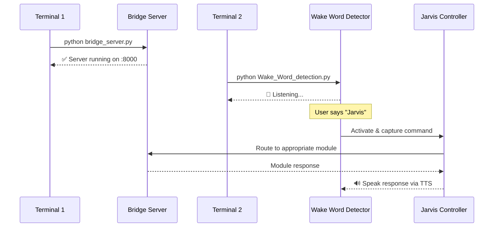

---

## 6. Phase 5: Features & Future Roadmap

### ✅ Current Feature Completion Status

| # | Feature | Module | Status |
|---|---|---|---|
| 1 | App Launcher | `app_launcher.py` | ✅ Done |
| 2 | Voice Recognition | `Wake_Word_detection.py` | ✅ Done |
| 3 | System Control | `system_controller.py` | ✅ Done |
| 4 | Window Management | `window_manager.py` | ✅ Done |
| 5 | Keyboard/Mouse Control | `keyboard_controller.py` | ✅ Done |
| 6 | News Fetching (GNews) | `gnews.py` | ✅ Done |
| 7 | Email Integration (Gmail) | `jarvis_email.py` | ✅ Done |
| 8 | Camera Vision + Gemini AI | `camera_vision.py` | ✅ Done |
| 9 | Medical Assistant | `medical.py` | ✅ Done |
| 10 | Desktop Features & Overlay UI | — | ✅ Done |
| 11 | WhatsApp Messaging | `mobile_controller.py` | ✅ Done |
| 12 | Mobile Controller | `mobile_controller.py` | ✅ Done |

### 🚀 Future Roadmap — Summary

| Priority | Feature | File | Difficulty | Est. Time |
|---|---|---|---|---|
| 🔴 **High** | Frontend Dashboard | `frontend/` | ⭐⭐ Medium | 2-3 weeks |
| 🔴 **High** | Custom Wake Word | `custom_wake_word.py` | ⭐⭐⭐ Hard | 3-4 weeks |
| 🟡 **Medium** | Spotify Control | `spotify_controller.py` | ⭐⭐ Medium | 1-2 weeks |
| 🟡 **Medium** | File Management | `file_manager.py` | ⭐ Easy | 1 week |
| 🟡 **Medium** | Google Calendar | `calendar_manager.py` | ⭐⭐ Medium | 1-2 weeks |
| 🟡 **Medium** | Screen Reading | `screen_reader.py` | ⭐⭐ Medium | 2 weeks |
| 🟢 **Low** | Hindi Voice | `hindi_voice.py` | ⭐⭐⭐ Hard | 3-4 weeks |
| 🟢 **Low** | Local LLM | `local_llm.py` | ⭐⭐⭐ Hard | 4+ weeks |
| 🟢 **Low** | Plugin System | `plugin_manager.py` | ⭐⭐ Medium | 2-3 weeks |

---

### 🚀 Future Module #1: 🖥️ Frontend Dashboard (`frontend/`)

**Priority:** 🔴 High | **Difficulty:** ⭐⭐ Medium | **Est. Time:** 2-3 weeks

**Purpose:** React ya Electron se ek visual UI dashboard banao jahaan saare commands, logs, module status, aur settings ek jagah dikhen. Browser ya desktop app dono mein chale.

**Tech Stack:** React 18+ (Vite), Tailwind CSS, Axios (API calls), Socket.IO (real-time updates)

**Additional Dependencies:**
```bash
npx -y create-vite@latest frontend -- --template react
cd frontend && npm install axios socket.io-client react-icons recharts
```

**Flow:**
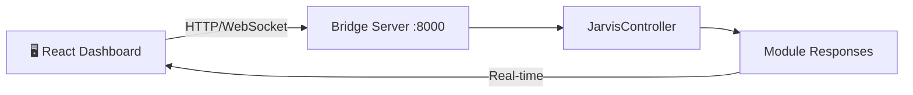

**Dashboard Pages:**

| Page | Description |
|---|---|
| `/` Home | System status, active modules, quick actions |
| `/commands` | Command history log with timestamps |
| `/settings` | API keys config, wake word toggle, theme |
| `/modules` | Individual module ON/OFF toggles |
| `/vision` | Live camera feed + AI analysis results |
| `/health` | Medical module conversation history |

**Implementation Checklist:**
- [ ] Vite + React project setup in `frontend/` folder
- [ ] Design system: dark theme, glassmorphism cards, accent colors
- [ ] Sidebar navigation with route switching
- [ ] Dashboard home page — module status cards with live indicators
- [ ] Command input bar (text commands via API)
- [ ] Command history log page with search/filter
- [ ] Settings page — `.env` variable editor (local only)
- [ ] WebSocket integration for real-time status updates
- [ ] Responsive layout (desktop + tablet)
- [ ] Bridge Server: add `GET /status`, `GET /history`, `WebSocket /ws` endpoints

**New API Endpoints Needed:**

| Method | Endpoint | Description |
|---|---|---|
| `GET` | `/status` | All modules ka current status |
| `GET` | `/history` | Command history with timestamps |
| `WS` | `/ws` | Real-time event stream |
| `POST` | `/settings` | Update runtime settings |

---

### 🚀 Future Module #2: 🎙️ Custom Wake Word (`custom_wake_word.py`)

**Priority:** 🔴 High | **Difficulty:** ⭐⭐⭐ Hard | **Est. Time:** 3-4 weeks

**Purpose:** Default "Jarvis" ki jagah apna custom wake word train karo (e.g., "TITAN", "Hey Computer"). Offline detection ke liye local ML model use hoga.

**Tech Stack:** OpenWakeWord, PyAudio, NumPy

**Additional Dependencies:**
```bash
pip install openwakeword pyaudio numpy
```

**Flow:**
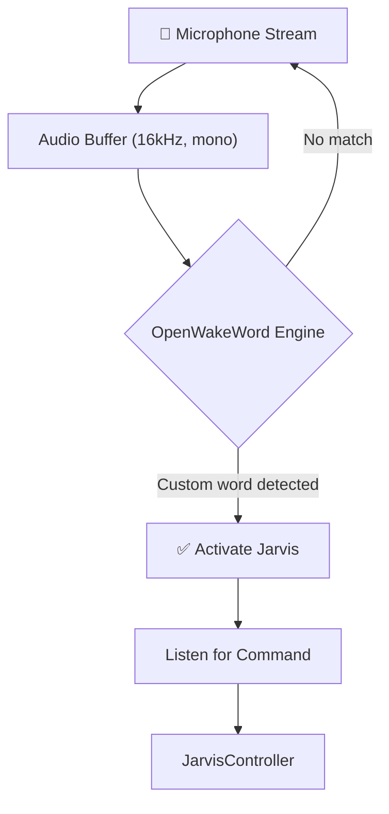

**Implementation Approach (Option B - OpenWakeWord):**
- Fully open-source and trainable offline.
- Requires some initial setup for the `.onnx` models, but no API key limits.

**Implementation Checklist:**
- [ ] Install `openwakeword`, `pyaudio`, and `numpy`
- [ ] Download or train an `.onnx` model for the custom wake word
- [ ] PyAudio microphone stream setup (16kHz, 16-bit, mono)
- [ ] Integrate OpenWakeWord model into the audio processing loop
- [ ] Replace current keyword matching in `Wake_Word_detection.py`
- [ ] Configurable wake word model path via `.env`
- [ ] Sensitivity tuning (threshold adjustments for false positives)
- [ ] Fallback to text-based "Jarvis" if audio engine fails

**New `.env` Variables:**
```env
WAKE_WORD_MODEL_PATH=models/titan_v1.onnx
WAKE_WORD_THRESHOLD=0.5
```

---

### 🚀 Future Module #3: 🎵 Spotify Control (`spotify_controller.py`)

**Priority:** 🟡 Medium | **Difficulty:** ⭐⭐ Medium | **Est. Time:** 1-2 weeks

**Purpose:** Voice commands se Spotify control karo — play, pause, skip, volume, playlist select, aur currently playing track info.

**Tech Stack:** Spotipy (Spotify Web API wrapper), OAuth 2.0

**Additional Dependencies:**
```bash
pip install spotipy
```

**Flow:**
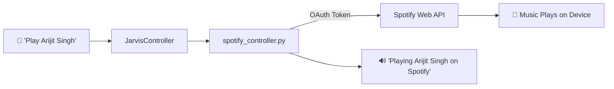

**Supported Commands:**

| Voice Command | Spotify Action |
|---|---|
| `spotify play [song/artist]` | Search & play track |
| `spotify pause` | Pause playback |
| `spotify resume` / `spotify continue` | Resume playback |
| `spotify next` / `skip` | Next track |
| `spotify previous` | Previous track |
| `spotify volume [0-100]` | Set Spotify volume |
| `spotify playlist [name]` | Play a playlist |
| `what's playing` / `current song` | Get current track info |
| `spotify shuffle on/off` | Toggle shuffle mode |

**Implementation Checklist:**
- [ ] Spotify Developer Dashboard par app create karo ([developer.spotify.com](https://developer.spotify.com))
- [ ] Client ID, Client Secret, Redirect URI configure karo
- [ ] OAuth 2.0 authorization flow implement karo (first-time browser auth)
- [ ] Token caching (`.cache` file) for persistent sessions
- [ ] Search API: song/artist/playlist search by voice query
- [ ] Playback control: play, pause, skip, previous, volume
- [ ] Current track info: title, artist, album, progress
- [ ] Active device detection (computer, phone, speaker)
- [ ] Error handling: no active device, premium required, token expired
- [ ] Add routes to `jarvis_controller.py` for all spotify commands

**New `.env` Variables:**
```env
SPOTIFY_CLIENT_ID=your_client_id
SPOTIFY_CLIENT_SECRET=your_client_secret
SPOTIFY_REDIRECT_URI=http://localhost:8888/callback
```

---

### 🚀 Future Module #4: 📁 File Management (`file_manager.py`)

**Priority:** 🟡 Medium | **Difficulty:** ⭐ Easy | **Est. Time:** 1 week

**Purpose:** Voice se files aur folders create, move, copy, delete, rename, aur search karo. Desktop aur Documents folder ke liye shortcut support.

**Tech Stack:** `os`, `shutil`, `pathlib`, `glob` (all built-in Python)

**Additional Dependencies:** None (all standard library)

**Flow:**
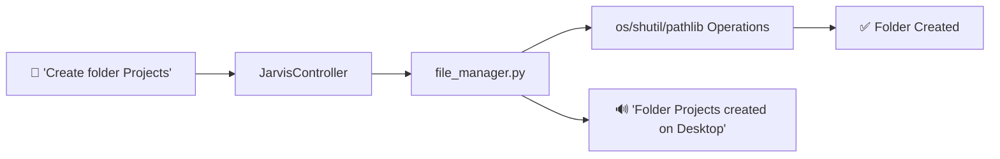

**Supported Commands:**

| Voice Command | Action |
|---|---|
| `create file [name]` | New file banao (Desktop default) |
| `create folder [name]` | New folder banao |
| `delete file [name]` | File delete karo (with confirmation) |
| `move [file] to [folder]` | File move karo |
| `copy [file] to [folder]` | File copy karo |
| `rename [file] to [name]` | File rename karo |
| `find file [name]` | File search karo |
| `list files in [folder]` | Folder contents dikhao |
| `open file [name]` | Default app mein kholо |

**Implementation Checklist:**
- [ ] Default paths define karo: Desktop, Documents, Downloads
- [ ] Create file/folder with `pathlib.Path`
- [ ] Delete with confirmation prompt (safety check)
- [ ] Move/copy with `shutil.move()` / `shutil.copy2()`
- [ ] Rename with `Path.rename()`
- [ ] Search with `glob.glob()` — recursive option
- [ ] List directory contents with formatted output
- [ ] Open file with `os.startfile()` (Windows)
- [ ] ⚠️ Safety: prevent deletion of system files/folders
- [ ] Path validation and error handling (file not found, permission denied)
- [ ] Add all file commands to `jarvis_controller.py`

> [!WARNING]
> Delete operations mein **confirmation prompt** zaroor rakho. Galti se system files delete na ho jayein.

---

### 🚀 Future Module #5: 📅 Google Calendar (`calendar_manager.py`)

**Priority:** 🟡 Medium | **Difficulty:** ⭐⭐ Medium | **Est. Time:** 1-2 weeks

**Purpose:** Voice se Google Calendar events create karo, upcoming events dekho, reminders set karo, aur daily schedule sunao.

**Tech Stack:** Google Calendar API v3, `google-auth`, `google-api-python-client`

**Additional Dependencies:**
```bash
pip install google-api-python-client google-auth-httplib2 google-auth-oauthlib
```

**Flow:**
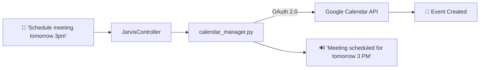

**Supported Commands:**

| Voice Command | Action |
|---|---|
| `schedule [event] at [time]` | New event create karo |
| `what's my schedule today` | Aaj ke events sunao |
| `upcoming events` / `next meeting` | Next events list karo |
| `remind me to [task] at [time]` | Reminder set karo |
| `cancel meeting [name]` | Event delete karo |
| `free slots tomorrow` | Available time slots dikhao |

**Implementation Checklist:**
- [ ] Google Cloud Console par Calendar API enable karo
- [ ] OAuth 2.0 credentials (`credentials.json`) download karo
- [ ] First-time authorization flow (browser consent screen)
- [ ] Token caching (`token.json`) for persistent access
- [ ] Create event: title, date/time parsing from natural language
- [ ] List events: today, tomorrow, this week filters
- [ ] Date/time NLP parsing (e.g., "tomorrow 3pm", "next Monday")
- [ ] Delete/update existing events by name match
- [ ] Reminder notifications (local system notification)
- [ ] Timezone handling (`Asia/Kolkata` default)
- [ ] Error handling: auth expired, API quota, invalid date
- [ ] Add calendar commands to `jarvis_controller.py`

**New Files Needed:**
```
backend/
├── credentials.json     # Google OAuth credentials (NEVER commit)
├── token.json           # Auto-generated auth token (NEVER commit)
```

**New `.gitignore` Entries:**
```gitignore
credentials.json
token.json
```

---

### 🚀 Future Module #6: 🖥️ Screen Reading (`screen_reader.py`)

**Priority:** 🟡 Medium | **Difficulty:** ⭐⭐ Medium | **Est. Time:** 2 weeks

**Purpose:** Screen ka screenshot le kar Gemini AI se content analyze karo — text extract karo, UI elements describe karo, ya screen par kya ho raha hai batao.

**Tech Stack:** Pillow (screenshot), Google Gemini API (vision), pytesseract (OCR fallback)

**Additional Dependencies:**
```bash
pip install pillow pytesseract
# Also install Tesseract OCR engine:
# Download from: https://github.com/UB-Mannheim/tesseract/wiki
```

**Flow:**
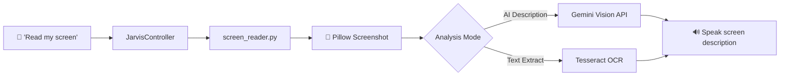

**Supported Commands:**

| Voice Command | Action |
|---|---|
| `read my screen` / `what's on screen` | Full screen AI analysis |
| `read this text` | OCR text extraction from screen |
| `read selected area` | User selects region to read |
| `summarize screen` | AI summary of screen content |
| `what app is open` | Identify active application |

**Implementation Checklist:**
- [ ] Full screen capture with `Pillow.ImageGrab.grab()`
- [ ] Region selection: mouse-based area selection for partial capture
- [ ] Gemini Vision API integration (reuse `camera_vision.py` pattern)
- [ ] Tesseract OCR for text-heavy screens (faster, offline)
- [ ] Smart mode selection: OCR for text, Gemini for complex UI
- [ ] Active window detection with title extraction
- [ ] Multi-monitor support
- [ ] Image compression before API call (reduce latency)
- [ ] Response formatting for TTS (concise summaries)
- [ ] Privacy: exclude sensitive areas (password fields detection)
- [ ] Add screen commands to `jarvis_controller.py`

> [!NOTE]
> Yeh module `GEMINI_API_KEY` reuse karega — koi naya API key nahi chahiye. Tesseract OCR optional hai as offline fallback.

---

### 🚀 Future Module #7: 🗣️ Hindi Voice (`hindi_voice.py`)

**Priority:** 🟢 Low | **Difficulty:** ⭐⭐⭐ Hard | **Est. Time:** 3-4 weeks

**Purpose:** TITAN ko full Hindi voice commands support do — Hindi mein bolo, Hindi mein jawaab mile. Hinglish (mixed Hindi-English) bhi support kare.

**Tech Stack:** Google Speech API (Hindi), gTTS (Hindi TTS), Gemini (Hindi NLP), `langdetect`

**Additional Dependencies:**
```bash
pip install gtts langdetect googletrans==4.0.0-rc1
```

**Flow:**
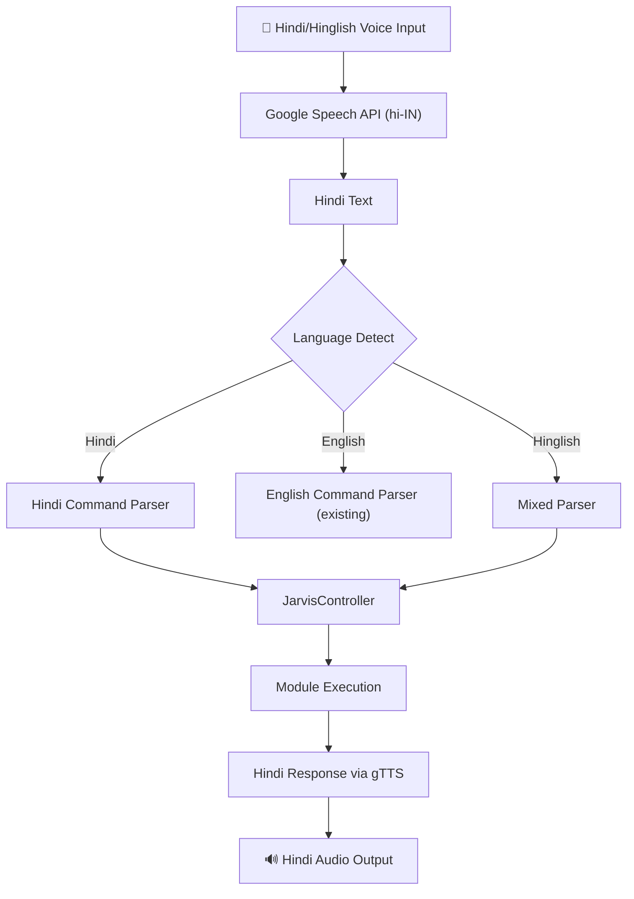

**Hindi Command Map:**

| Hindi Command | English Equivalent | Action |
|---|---|---|
| `notepad kholo` | `open notepad` | App launch |
| `gaana bajao [X]` | `play [X]` | YouTube play |
| `awaaz badhaao` | `volume up` | Volume increase |
| `screen band karo` | `lock screen` | Lock screen |
| `kya news hai` | `what's the news` | News fetch |
| `email bhejo` | `send email` | Email send |
| `photo lo` | `take photo` | Camera capture |
| `file banao [name]` | `create file [name]` | File create |

**Implementation Checklist:**
- [ ] Google Speech API `language="hi-IN"` for Hindi recognition
- [ ] Language detection with `langdetect` (auto-detect Hindi vs English)
- [ ] Hindi command keyword dictionary (mapping Hindi → English actions)
- [ ] Hinglish parser: handle mixed language ("notepad kholo", "volume up karo")
- [ ] Hindi TTS with `gTTS` (lang='hi') for Hindi responses
- [ ] Switchable language mode via command ("switch to Hindi" / "Hindi mode")
- [ ] Fallback: if Hindi command not matched, try English parser
- [ ] Gemini AI for complex Hindi queries (natural conversation)
- [ ] Hindi medical keywords expansion (extend `medical.py`)
- [ ] User preference storage: default language in `.env`
- [ ] Add `LANGUAGE_MODE` to `.env` (`en` / `hi` / `auto`)

**New `.env` Variables:**
```env
LANGUAGE_MODE=auto   # Options: en, hi, auto
```

---

### 🚀 Future Module #8: 🧠 Local LLM (`local_llm.py`)

**Priority:** 🟢 Low | **Difficulty:** ⭐⭐⭐ Hard | **Est. Time:** 4+ weeks

**Purpose:** Ollama ya llama.cpp use karke local/offline AI model chalao. Internet ke bina bhi TITAN intelligent responses de sake. Gemini ke fallback ya replacement ke roop mein kaam kare.

**Tech Stack:** Ollama, `ollama` Python SDK, llama.cpp (optional)

**Additional Dependencies:**
```bash
# Install Ollama: https://ollama.ai/download
# Then pull a model:
ollama pull llama3.2
ollama pull mistral

# Python SDK:
pip install ollama
```

**Flow:**
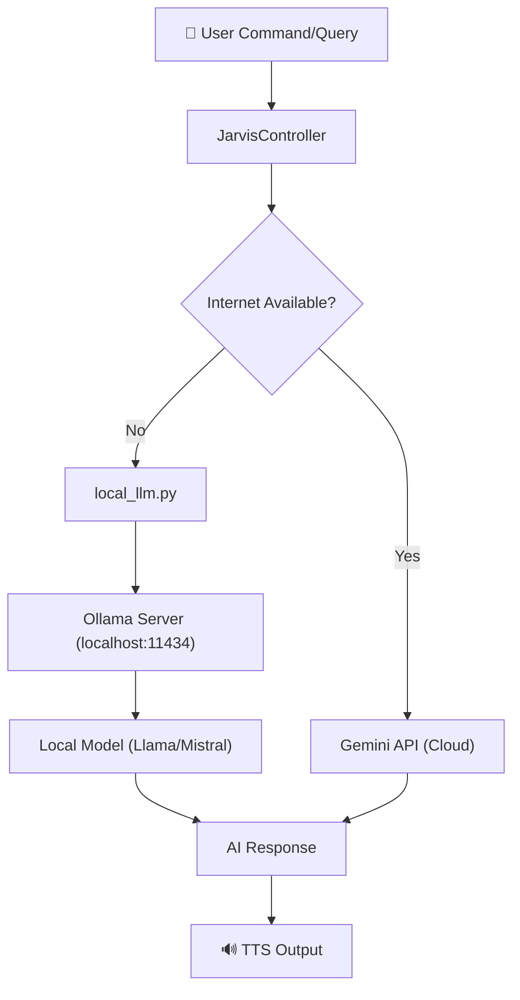

**Supported Models:**

| Model | Size | Speed | Best For |
|---|---|---|---|
| `llama3.2:3b` | ~2GB | Fast | Quick commands, chat |
| `llama3.2:7b` | ~4GB | Medium | General queries |
| `mistral:7b` | ~4GB | Medium | Code, reasoning |
| `gemma2:2b` | ~1.5GB | Very Fast | Lightweight tasks |
| `llava:7b` | ~4.5GB | Slow | Vision (camera replacement) |

**Implementation Checklist:**
- [ ] Ollama installation check aur auto-detect
- [ ] Model availability check (`ollama list`)
- [ ] Auto-pull model if not present (with user confirmation)
- [ ] Chat completion API integration (`ollama.chat()`)
- [ ] Streaming responses for long answers
- [ ] System prompt configuration for Jarvis personality
- [ ] Fallback chain: Gemini → Local LLM → keyword-based
- [ ] Internet connectivity check for auto-switching
- [ ] Vision model support (LLaVA) as camera_vision fallback
- [ ] Model switching via command ("use local AI" / "use cloud AI")
- [ ] GPU detection: CUDA/Metal acceleration if available
- [ ] Memory management: unload model when idle
- [ ] Response quality comparison logging (local vs cloud)
- [ ] Add `AI_MODE` to `.env` (`cloud` / `local` / `auto`)

**New `.env` Variables:**
```env
AI_MODE=auto              # Options: cloud, local, auto
LOCAL_MODEL=llama3.2:3b   # Default Ollama model
OLLAMA_HOST=http://localhost:11434
```

**Hardware Requirements:**

| Model Size | Min RAM | Recommended GPU |
|---|---|---|
| 2-3B params | 4GB | None (CPU OK) |
| 7B params | 8GB | 4GB VRAM |
| 13B params | 16GB | 8GB VRAM |

> [!WARNING]
> Local LLM chalane ke liye minimum **8GB RAM** recommended hai. 7B models bina GPU ke slow chalenge.

---

### 🚀 Future Module #9: 🔌 Plugin System (`plugin_manager.py`)

**Priority:** 🟢 Low | **Difficulty:** ⭐⭐ Medium | **Est. Time:** 2-3 weeks

**Purpose:** Ek extensible plugin architecture banao jisse koi bhi developer apna custom module add kar sake bina core code change kiye. Hot-reload support ke saath.

**Tech Stack:** `importlib` (dynamic loading), `abc` (abstract base), `watchdog` (file monitoring)

**Additional Dependencies:**
```bash
pip install watchdog
```

**Plugin Directory Structure:**
```
TITAN/
├── backend/
│   ├── plugins/
│   │   ├── __init__.py
│   │   ├── plugin_manager.py        # Plugin loader & registry
│   │   ├── base_plugin.py           # Abstract base class
│   │   ├── weather_plugin/          # Example plugin
│   │   │   ├── __init__.py
│   │   │   ├── plugin.py            # Main plugin code
│   │   │   └── config.json          # Plugin metadata
│   │   ├── calculator_plugin/       # Another plugin
│   │   │   ├── __init__.py
│   │   │   ├── plugin.py
│   │   │   └── config.json
│   │   └── ...
```

**Flow:**
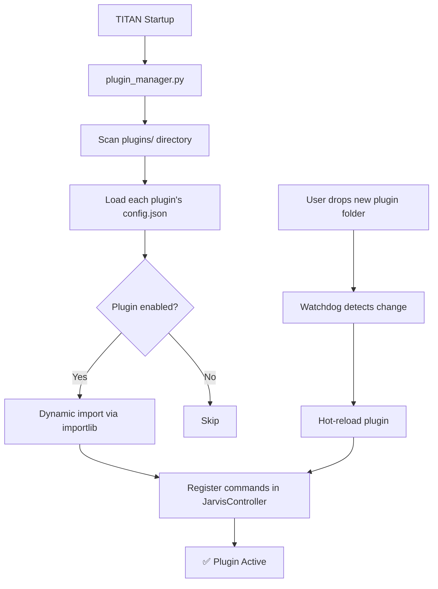

**Base Plugin Template (`base_plugin.py`):**
```python
from abc import ABC, abstractmethod

class BasePlugin(ABC):
    @abstractmethod
    def get_name(self) -> str: ...

    @abstractmethod
    def get_commands(self) -> list[str]: ...

    @abstractmethod
    def execute(self, command: str, args: str) -> str: ...

    def on_load(self): pass
    def on_unload(self): pass
```

**Example Plugin Config (`config.json`):**
```json
{
    "name": "Weather Plugin",
    "version": "1.0.0",
    "author": "Developer",
    "description": "Get weather info by voice",
    "commands": ["weather", "temperature", "forecast"],
    "enabled": true,
    "dependencies": ["requests"]
}
```

**Implementation Checklist:**
- [ ] `BasePlugin` abstract class with standard interface
- [ ] `PluginManager` class: discover, load, register, unload plugins
- [ ] Dynamic import with `importlib.import_module()`
- [ ] `config.json` parser for plugin metadata
- [ ] Auto-install plugin dependencies from config
- [ ] Command registration in `JarvisController` at runtime
- [ ] Plugin enable/disable via voice command ("disable weather plugin")
- [ ] Hot-reload with `watchdog` file system monitoring
- [ ] Plugin listing command ("list plugins" → shows all installed)
- [ ] Error isolation: one plugin crash shouldn't affect others
- [ ] Plugin API: give plugins access to TTS, Gemini, and system utils
- [ ] Example plugins: Weather, Calculator, Todo List, Joke Generator
- [ ] Documentation: "How to Create a TITAN Plugin" guide

**Plugin Management Commands:**

| Voice Command | Action |
|---|---|
| `list plugins` | Installed plugins dikhao |
| `enable plugin [name]` | Plugin activate karo |
| `disable plugin [name]` | Plugin deactivate karo |
| `reload plugins` | Saare plugins reload karo |

---

## 7. Architecture & Flow Distribution

### System Flow Diagram

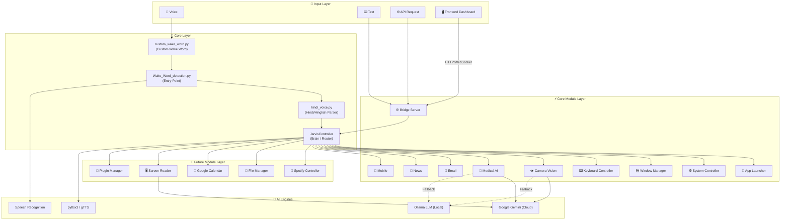

### Feature Distribution by Category (Updated with Future Modules)

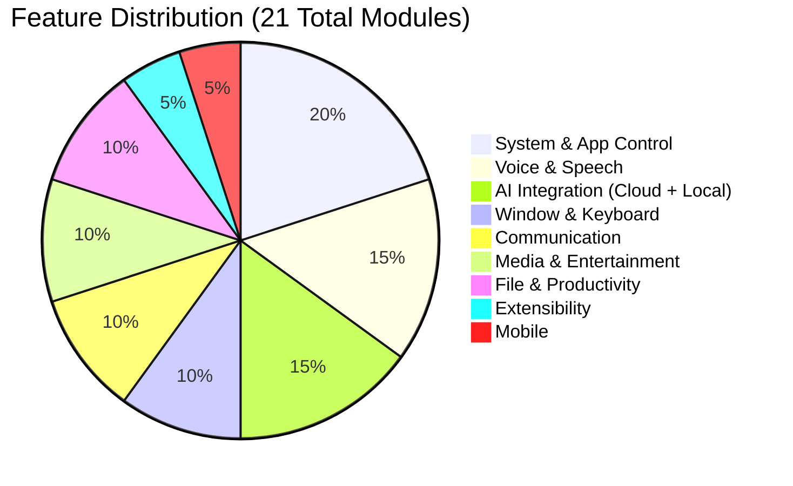

---

## 8. Quick Command Reference

**Core Commands:**

| Command | Action | Example |
|---|---|---|
| `launch` / `open [app]` | App open karo | `open notepad` |
| `play song/video [X]` | YouTube par chalao | `play Bollywood songs` |
| `search` / `google [query]` | Google search karo | `search Python tutorial` |
| `type [text]` | Text type karo | `type Hello World` |
| `press [key]` | Key press karo | `press enter` |
| `volume up/down` | Volume badhaao/ghatao | `volume up by 10` |
| `minimize/maximize/close [win]` | Window control | `minimize Notepad` |
| `lock screen` | Screen lock karo | `lock screen` |
| `send msg to X saying Y` | WhatsApp message | `send message to Raj saying hello` |
| `take photo` | Camera + AI describe | `take photo` |
| `news` / `headlines` | Latest news sunao | `tell me the news` |
| `send email to X` | Gmail se email | `send email to boss` |
| `health` / `medical` | Health advice | `I have a headache` |

**🆕 Future Module Commands:**

| Command | Module | Action | Example |
|---|---|---|---|
| `spotify play [X]` | Spotify | Music play karo | `spotify play Arijit Singh` |
| `spotify pause/next/previous` | Spotify | Playback control | `spotify next` |
| `what's playing` | Spotify | Current track info | `what's playing` |
| `create file/folder [name]` | File Manager | File/folder banao | `create folder Projects` |
| `delete file [name]` | File Manager | File delete karo | `delete file old_notes.txt` |
| `move [file] to [folder]` | File Manager | File move karo | `move report to Documents` |
| `find file [name]` | File Manager | File search karo | `find file resume` |
| `schedule [event] at [time]` | Calendar | Event create karo | `schedule meeting tomorrow 3pm` |
| `what's my schedule today` | Calendar | Today ke events | `what's my schedule today` |
| `remind me to [X] at [time]` | Calendar | Reminder set karo | `remind me to call doctor at 5pm` |
| `read my screen` | Screen Reader | Screen analyze karo | `read my screen` |
| `summarize screen` | Screen Reader | Screen summary | `summarize screen` |
| `switch to Hindi` | Hindi Voice | Hindi mode ON | `Hindi mode` |
| `notepad kholo` | Hindi Voice | Hindi command | `gaana bajao Bollywood` |
| `use local AI` | Local LLM | Offline AI switch | `use local AI` |
| `use cloud AI` | Local LLM | Online AI switch | `use cloud AI` |
| `list plugins` | Plugin System | Plugins dikhao | `list plugins` |
| `enable/disable plugin [X]` | Plugin System | Plugin toggle | `disable weather plugin` |
| `reload plugins` | Plugin System | Hot-reload plugins | `reload plugins` |

---

## 9. Troubleshooting & FAQs

### ❓ Q: Microphone kaam nahi kar raha?

**Solutions:**
1. `pip install pyaudio` properly install karo
   - Windows par error aaye toh: `pip install pipwin && pipwin install pyaudio`
2. **Windows Settings** → Privacy → Microphone → "Allow apps" check karo
3. Correct mic input device selected hai ya nahi verify karo

---

### ❓ Q: "ModuleNotFoundError" aa raha hai?

**Solutions:**
1. Check karo ki `venv` activate hua ya nahi — `(venv)` prefix hona chahiye
2. Phir `pip install -r requirements.txt` chalao
3. Correct Python version check karo: `python --version`

---

### ❓ Q: Bridge Server start nahi ho raha?

**Solutions:**
1. Port `8000` busy ho sakta hai
2. Doosra port use karo:
   ```bash
   uvicorn bridge_server:app --reload --port 8001
   ```
3. Check karo koi aur process port use toh nahi kar raha:
   ```powershell
   netstat -ano | findstr :8000
   ```

---

### ❓ Q: Gemini API kaam nahi kar raha?

**Solutions:**
1. `.env` mein `GEMINI_API_KEY` sahi hai ya verify karo
2. [aistudio.google.com](https://aistudio.google.com) par jaake check karo key active hai ya nahi
3. API quota exceed toh nahi ho gaya — free tier ka limit check karo
4. Internet connection check karo

---

### ❓ Q: Email send nahi ho raha?

**Solutions:**
1. **Normal Gmail password nahi chalega** — App Password chahiye
2. **2FA ON** hona zaroori hai (tabhi App Password option milega)
3. `.env` mein `EMAIL_PASSWORD` mein 16-character App Password daalo
4. "Less secure apps" option ab Google ne hata diya hai — App Password hi option hai

---

### ❓ Q: Voice galat samajh raha hai?

**Solutions:**
1. **Quiet jagah** par use karo — background noise problem hoti hai
2. Mic volume check karo (Windows Sound Settings)
3. Google Speech API ke liye **internet connection zaroori hai**
4. Clearly aur thoda slowly bolo
5. Mic hardware check karo — earphone mic vs. built-in laptop mic

---

## 📌 Development Checklist Summary

### Phase 1: Environment ✅
- [ ] Python 3.11 installed with PATH
- [ ] Project extracted to clean directory
- [ ] Virtual environment created & activated
- [ ] All dependencies installed via pip

### Phase 2: Core Modules 🔨
- [ ] Wake word detection working
- [ ] Bridge server running on port 8000
- [ ] Jarvis controller routing commands
- [ ] All 12 core modules implemented & tested

### Phase 3: Configuration 🔑
- [ ] `.env` file created with all keys
- [ ] Gemini API key active & tested
- [ ] GNews API key active & tested
- [ ] Gmail App Password configured
- [ ] `.gitignore` includes `.env`

### Phase 4: Running 🚀
- [ ] Bridge server starts without errors
- [ ] Wake word detection activates on "Jarvis"
- [ ] API endpoints accessible via `/docs`
- [ ] End-to-end voice command flow working

### Phase 5: Polish & Extend 🎯
- [ ] All current features tested
- [ ] Error handling in all modules
- [ ] Command history logging
- [ ] Future roadmap items prioritized

### Phase 6: Future Modules 🆕

**🔴 High Priority:**
- [ ] Frontend Dashboard — React/Vite project setup & connected to API
- [ ] Frontend Dashboard — All 6 pages built (Home, Commands, Settings, Modules, Vision, Health)
- [ ] Frontend Dashboard — WebSocket real-time updates working
- [ ] Custom Wake Word — Porcupine/OpenWakeWord integrated
- [ ] Custom Wake Word — Configurable via `.env`
- [ ] Custom Wake Word — Sensitivity tuning complete

**🟡 Medium Priority:**
- [ ] Spotify Control — OAuth flow & token caching working
- [ ] Spotify Control — All playback commands (play/pause/skip/volume) functional
- [ ] Spotify Control — Current track info via voice
- [ ] File Management — Create/delete/move/copy/rename working
- [ ] File Management — Safety checks (confirmation before delete)
- [ ] File Management — File search with glob
- [ ] Google Calendar — OAuth setup & token caching
- [ ] Google Calendar — Create/list/delete events working
- [ ] Google Calendar — Natural language date parsing
- [ ] Screen Reading — Screenshot + Gemini analysis working
- [ ] Screen Reading — OCR fallback with Tesseract
- [ ] Screen Reading — Region selection support

**🟢 Low Priority:**
- [ ] Hindi Voice — Hindi speech recognition (`hi-IN`) working
- [ ] Hindi Voice — Hindi command keyword dictionary complete
- [ ] Hindi Voice — Hinglish mixed-language parser working
- [ ] Hindi Voice — Hindi TTS (gTTS) output working
- [ ] Local LLM — Ollama installed & model pulled
- [ ] Local LLM — Chat completion API working
- [ ] Local LLM — Auto-fallback (Cloud → Local → Keyword)
- [ ] Local LLM — Vision model (LLaVA) as camera fallback
- [ ] Plugin System — BasePlugin class & PluginManager built
- [ ] Plugin System — Dynamic import & command registration
- [ ] Plugin System — Hot-reload with watchdog
- [ ] Plugin System — 2+ example plugins (Weather, Calculator)

---

> [!TIP]
> **Pro Tip:** Start with Phase 1-3 setup, then test each module individually before running the full system. Yeh approach debugging bahut easy bana deta hai!

---

*Last Updated: June 3, 2026*
*Version: 2.0 — Full Roadmap with 21+ Module Deep-Dives*
*Author: TITAN Development Team*
